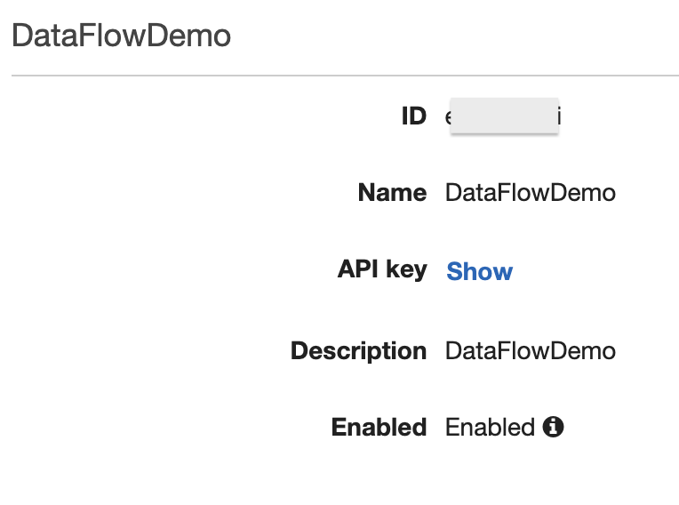

# Demo instructions for the no-code data ingestion using Amazon API Gateway and Amazon S3

This solution demonstrates simple no-code ingestion approach for batch type of ingestion use cases.

## Architecture


## Prerequisites

- You have an existing Amazon S3 bucket that's in same Region
  where you plan to deploy CloudFormation stack in following steps.   
  *To create an Amazon S3 bucket, please see [creating s3 bucket](https://docs.aws.amazon.com/AmazonS3/latest/userguide/creating-bucket.html).*

## Demo details

1. Deploy the `cloudformation-stack.template` CloudFormation Template location in this folder.
   For `S3BucketName` parameter, enter the S3 bucket name from **prerequisites**.  
   *For instructions on creating a CloudFormation stack, see [initiating stack creation](https://docs.aws.amazon.com/AWSCloudFormation/latest/UserGuide/cfn-console-create-stack.html#cfn-using-console-initiating-stack-creation)
   guide using stack template [upload a template file](https://docs.aws.amazon.com/AWSCloudFormation/latest/UserGuide/cfn-using-console-create-stack-template.html).*
2. On deployment complete, open the CloudFormation stack `Outputs` tab.  
   
3. Open the link on the `ApiKeyValue` value. Click `Show` to see the API key secret. Paste the value to your notes.  
   
4. Back in the CloudFormation stack `Outputs` tab, observe the `ApiGatewayUrlEndpoint` key.
5. In the curl command below, replace the variables with values for `ApiGatewayUrlEndpoint` and `ApiKeyValue`.
```shell
curl -X PUT ${ApiGatewayUrlEndpoint}/myfile.json \
   -H "x-api-key: ${ApiKeyValue}" \
   -H "Content-Type: application/json" \
   -d '{"msg": "hello"}'
```
6. Open the S3 bucket, observe new file `myfile.json`. Open the file, observe the data is `{"msg": "hello"}`

## Clean up

1. Delete the CloudFormation Stack.
2. (Optional) Delete the file in S3 bucket and the S3 bucket itself.


## Security

See [CONTRIBUTING](CONTRIBUTING.md#security-issue-notifications) for more information.

## License

This library is licensed under the MIT-0 License. See the LICENSE file.

